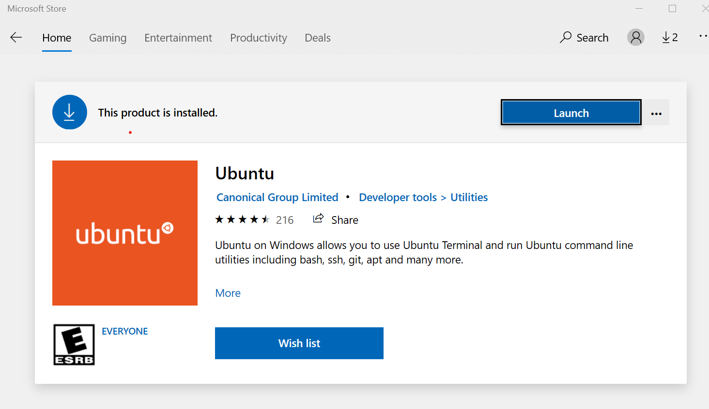
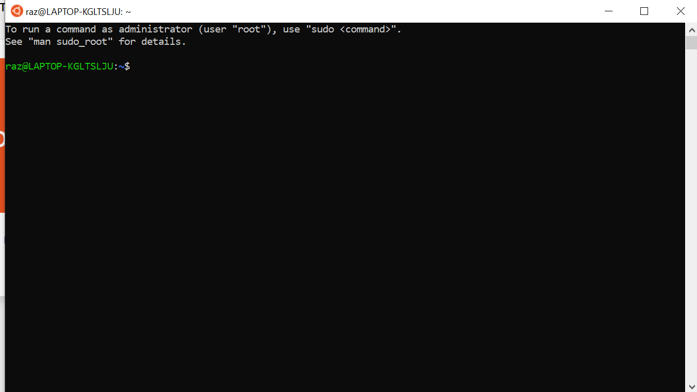
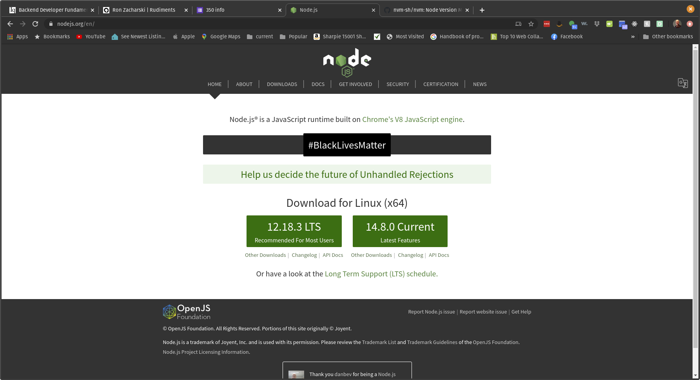
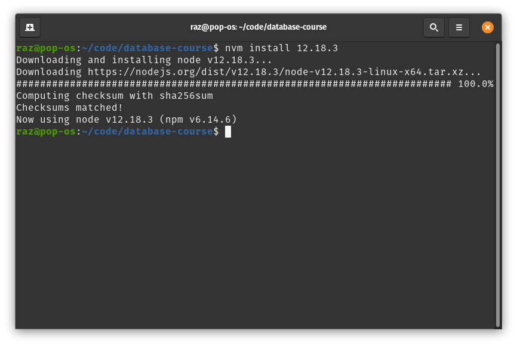
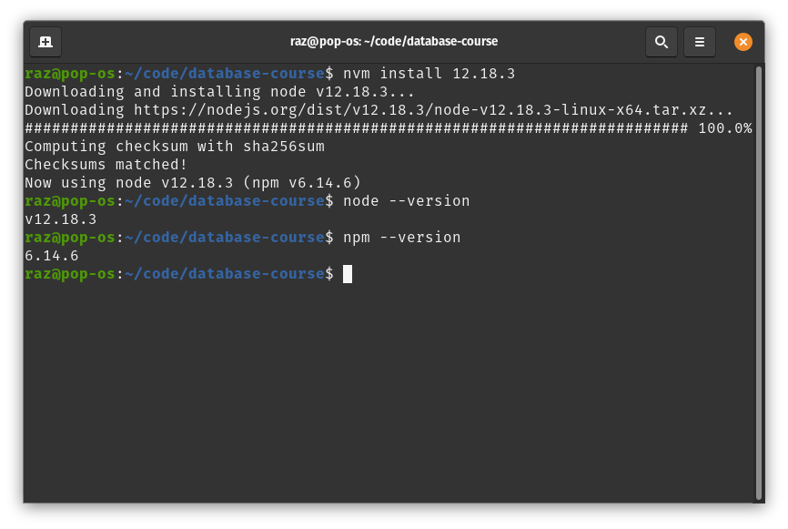
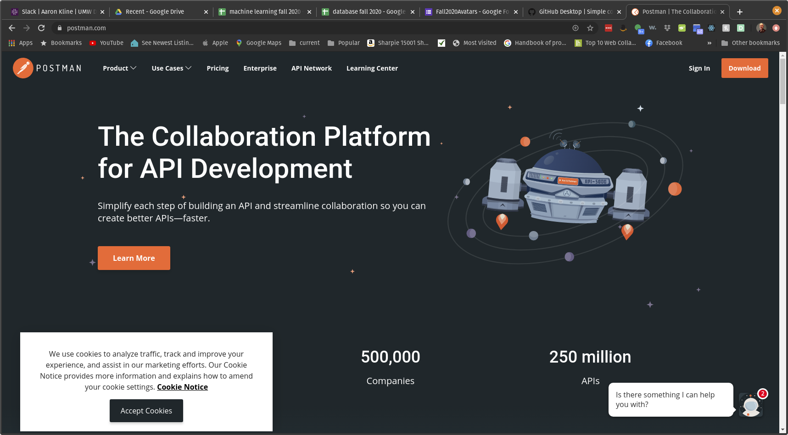
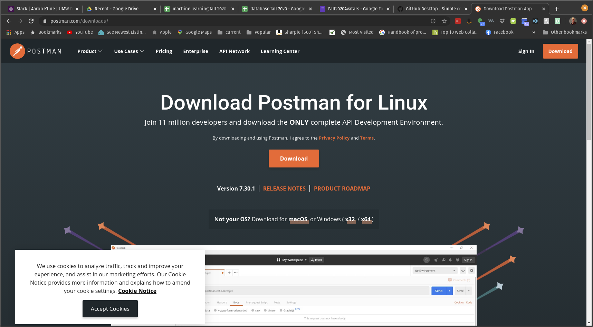

# Environment Setup

This page based on one from the [Ada Developers Academy](https://github.com/Ada-Developers-Academy/jump-start/blob/master/preparing-to-code/environment-setup/README.md)

## Learning Goals

* To setup a development environment
* Gain confidence in using VS Code

## Activities

* Review notes
* Complete install of essential software
  * VS Code
  * Github desktop
  * NVM
  * Node
  * NPM
  * PostgreSQL
  * Postman

## Notes

### Text Editors

A text editor is a computer program that allows you to create and edit files that contain plain text. This is different than a robust word processing program like Microsoft Word, or Google Docs. When you're writing computer code, you don't need or want any special formatting to be part of the file. In fact, your code probably won't work at all unless it was written and saved in a plain text environment.

Text editors are commonly used by web designers and developers because it provides maximum flexibility to create just about anything. A text editor is not the same thing as an integrated development environment (IDE). While almost every IDE has the capability of creating and editing plain text documents, they also include a wealth of other features and powerful capabilities.

As the notes below illustrate, we use [Visual Studio Code](https://code.visualstudio.com/) (VS Code) as our official text editor at Inquiryum.  In the future all projects will be written in VS Code.  

**NOTE**: VS Code has a terminal screen.  We ask you **not** to use it.  Instead maintain a separate terminal window when you write code at Ada.  It will help with your workflow.  

**NOTE 2**: You've probably been required to use vi, vim, or emacs in another class. When you are developing code you don't want the editor to hinder you. Instead, you want the editor to fit like a glove and to be super comfortable with it. You don't want to be stumbling over some archaic vim command instead of focusing on the task of writing code. Again, the official editor for the course is VS Code.

## Installfest


### VS Code

Whether you are on a Mac, a Windows 10 machine, or one running Linux, Visual Studio Code is easy to install.  Follow the instructions on the http://code.visualstudio.com website.

### Git

If you are on Windows or Mac OSX you can use [the Github desktop client](https://desktop.github.com/) or use the command line tools. For Linux the command line tools work fine.

### NodeJS

#### Windows 10

Windows 10 users have two basic options: either run everything directly on Windows 10 or use Ubuntu on Windows, which provides a Ubuntu Virtual Machine. Let's look at that option first. 

You install Ubuntu on Windows from the Microsoft Store (it is free):

 

Once you install and launch it you get an Ubuntu terminal with access to a Linux system.



Once you have the Ubuntu terminal you can install everything using the Linux commands below. You can edit code using the VS Code editor you installed below, and then you run that could in the Ubuntu terminal.

As I mentioned, the other option is to run everything in Windows 10. I have talked with several developers who are happily using this method but I have no direct experience with it.

### installing NodeJS on Linux, Mac, and Ubuntu on Windows

The next task is to install `nvm` or node version manager. Follow the instructions on https://github.com/nvm-sh/nvm. At the time of me writing this, the newest version of nvm was 35.3 and the command to install it was

```
curl -o- https://raw.githubusercontent.com/nvm-sh/nvm/v0.35.3/install.sh | bash
```

Once that is installed we can use `nvm` to install the latest version of `node` and `npm` (node package manager). To do that we need to find out the latest version of node. To do that go to https://nodejs.org/en/



In the above image the safe choice is 12.18.3 and the adventurous choice is 14.8.0. It is up to you -- either will work fine for the course. To install 12.18.3 we execute:


```
nvm install 12.18.3
```



We can check that it indeed got install by executing


```
node --version
```

and

```
npm --version
```




### Installing postgreSQL

#### on Ubuntu and Ubuntu on Windows

There is a information on installing postgreSQL on the [Inquiryum  Getting Started with PostgreSQL video](http://inquiryum.com/modules/sql%20module/Postgres-Getting-Started/)

#### on Mac OSX

The best option on the Mac is [Postgres.app](https://postgresapp.com/)

### Postman

The final software package, Postman, is easy to install. Just head over to postman.com:



Click the download button on the upper right:



and follow the instructions.


### Congratulations: 

### You just installed the necessary tools for your development environment


##### References

* [A Convincing Case for Visual Studio Code](https://blog.bitsrc.io/a-convincing-case-for-visual-studio-code-c5bcc18e1693)

