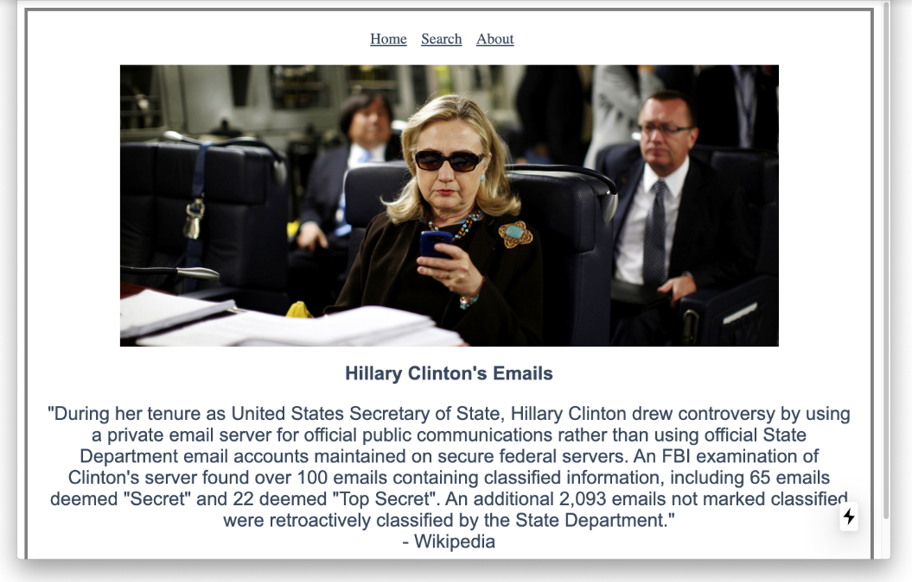
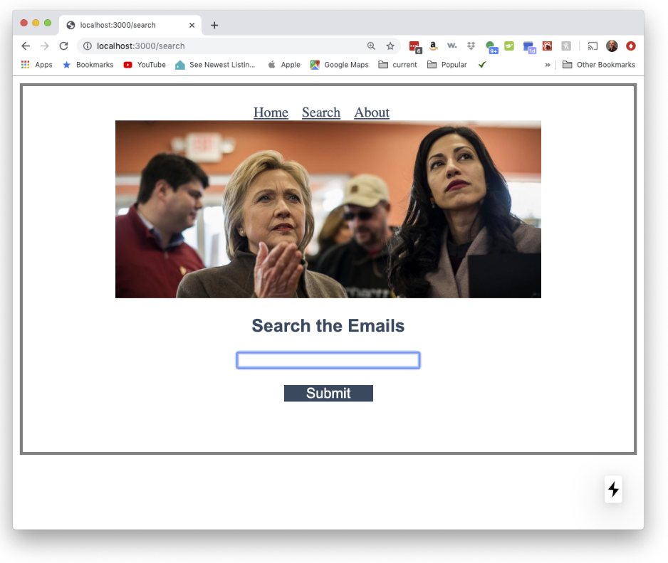
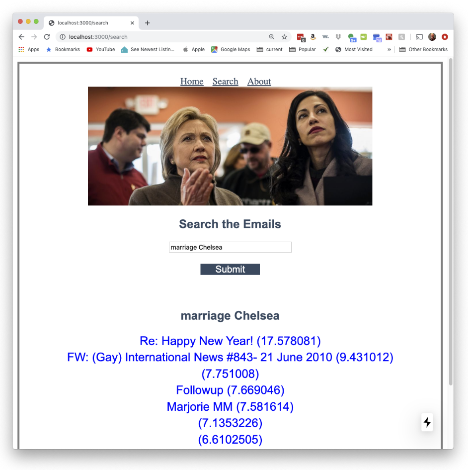
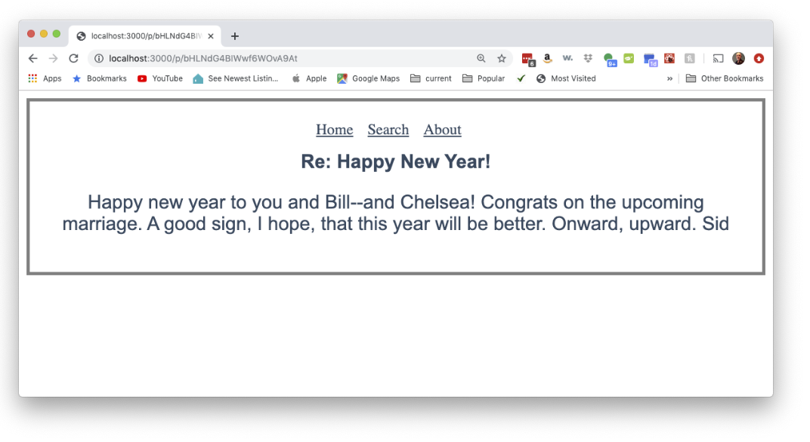
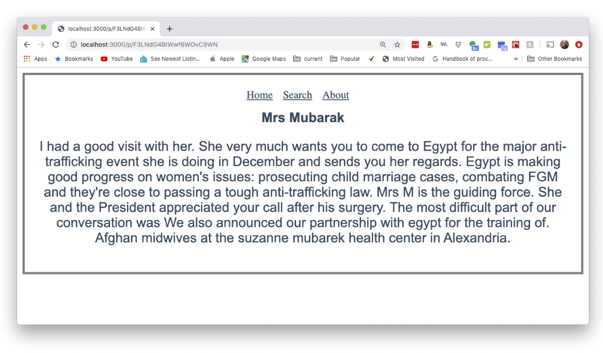

# Elasticsearch - Clinton Emails

#### From Kaggle:

Throughout 2015, Hillary Clinton has been embroiled in [controversy](https://en.wikipedia.org/wiki/Hillary_Clinton_email_controversy) over the use of personal email accounts on non-government servers during her time as the United States Secretary of State. Some political experts and opponents maintain that Clinton's use of personal email accounts to conduct Secretary of State affairs is in violation of protocols and federal laws that ensure appropriate recordkeeping of government activity. Hillary's campaign has provided their own four sentence summary of her email use [here](https://www.hillaryclinton.com/hillarys-emails-four-sentences/).

There have been a number of Freedom of Information [lawsuits](https://en.wikipedia.org/wiki/Hillary_Clinton_email_controversy#Freedom_of_Information_lawsuits) filed over the State Department's failure to fully release the emails sent and received on Clinton's private accounts. On Monday, August 31, the State Department released nearly 7,000 pages of Clinton's heavily redacted emails (its biggest release of emails to date).

The documents were released by the State Department as PDFs. We've cleaned and normalized the released documents and are hosting them for public analysis. Kaggle's choice to host this dataset is not meant to express any particular political affiliation or intent.

## Project Description

You are to write an Elasticsearch powered web application that allows a user to search a collection of Hillary Clinton emails. This dataset is the largest public email dataset in the world. 
Alternatively, you can select a different dataset to use (there are a lot of resources on Kaggle) . If you have an idea for an alternative, message me. I will give additional creative xp points if you have an interesting dataset. 

## Minimal Requirements

Minimally, your code should be as good as shown in this video.

[Video example](https://youtu.be/RbnCaSxj6aY)

You are free to implement a better design.

#### more on the baseline example

To mirror the other examples in the course, we have three pages including a home page:

​	At least, users should be able to search the body of the emails:

When the user submits a search request they should see a list of results:

The example above only has the subject line of the email and the Elasticsearch rating. You can have what you want. 

When a user clicks on an email they see the entire email.

### The dataset

The dataset is available [here](https://www.kaggle.com/kaggle/hillary-clinton-emails/data). You need to create a free account first.

## Demo and XP

There is a potential for 250xp. You can demo several times. First, to get points for the basic system and then once you add any improvements.  

Description | xp
:--- | :---
Demo basic functions on laptop and it looks at least as good as the screen shots above | 80
Demo on Cloud | +70
Professional looking page (subjective) | +20 
Allow a user to have more complex queries. For example,  google has the option to say results must include the searchterm. Allow the user to search multiple fields of the email (in a particular date range or text in the subject. | +25 
Using some new technology (for ex., Google Cloud Build) | +50 

For demoing code running on a laptop link to a comprehensive video demo (via Slack message to me) in addition to having your code on github. For cloud demos, supply the URL in the usual way.

