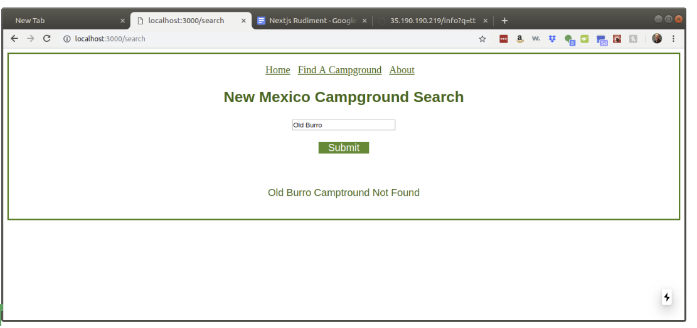

# NextJS Rudiment - Campground Search

#### NOTE: You do not need to write the backend code. It is provided to you.

#### The server api.

The provided server has only one get request:

http://35.190.190.219/api/info?q=Apache

where `q` is the name of the campground

Again, do not write the backend code and do not create a database. Those are provided to you.

A walk through of the basic features of this app is available in [this YouTube video](https://youtu.be/0la-Rk6wqP8). 

### The basic requirements are:

* The app must be running in the production environment (Google Cloud VM with NGINX reverse proxy)
* All code must be committed to github
* It must entirely be done in Nextjs.
* The app must have a minimum of 3 pages.
* You must use a router
  * The back and forward button must work
  * When a user hits refresh on a page it should work
  * If a user navigates to a page that doesn’t exist, your app should display a 404 error page
* Two of these three pages can have minimal content. An image and some text.
* The third page enables a search feature that enables a user to search for a Campground and display the search results (as shown in the video)
* The displayed results should include an image of the campground.
* If there are no results for a search your code should display “not found” or some other helpful message (see screenshot at the end of this write-up
* Creative: If you make your UI significantly more attractive than my demo site you get will an additional 25 xp (or more)

The server has minimal content and only has information for the following campgrounds

* Apache 
* Apache Creek 
* Armijo Springs 
* Baca 
* James Canyon
* Oak Grove 
* Piñon 
* Pueblo Park 
* Railroad Canyon 
* Saddle 
* South Fork 
* Taylor's Railroad 
* Three Rivers 
* Wolf Hollow

