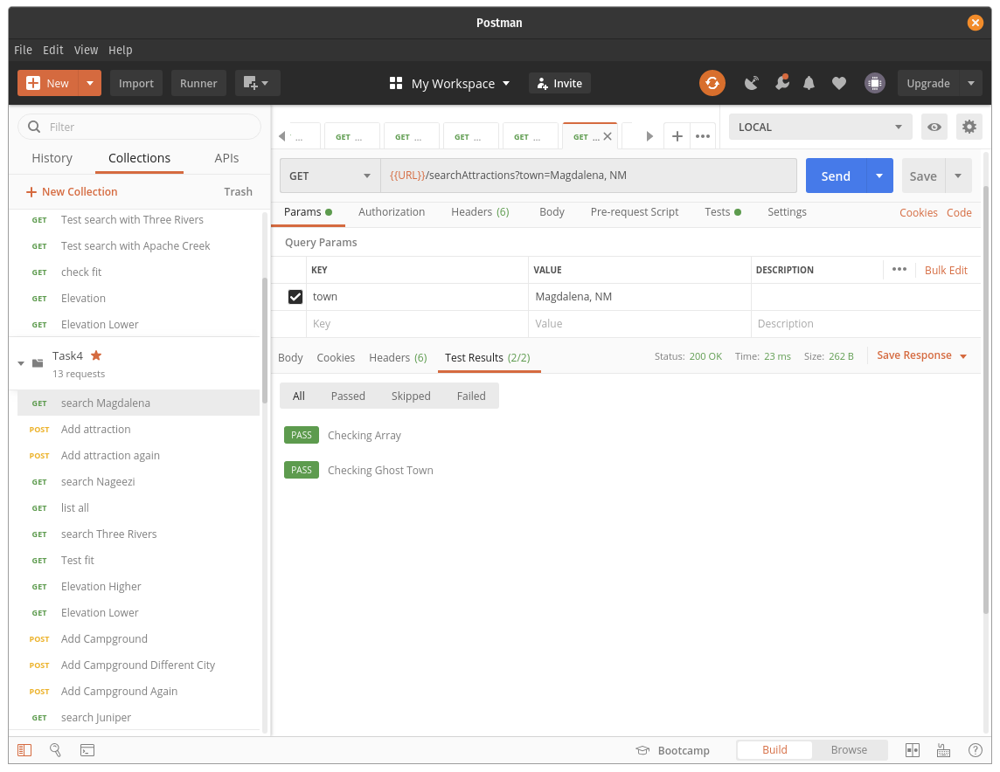

# Task 4. NodeJS and PostgreSQL


In the section on PostgreSQL and NodeJS of the NodeJS module you learned how to write code that makes asynchronous calls to a PostgreSQL database.


This task is designed to help you practice these skills. 


## The steps

### Step 0 installation of software

In previous tasks you have installed

* nvm
* npm
* node
* postgresql
* Postman


No additional software is needed for this step.

### Step 1 clone the code

The files we need are in the same folder as this readme file.  The easiest way to obtain the files is to clone the entire repository

`git clone https://github.com/zacharski/database-course.git`

For the gitlab lab we created our own git repository. We want to copy the task4 folder that was part of the repository we just cloned, to our db-class repository in the practice folder.  For example,

`cp -r tasks/task4 ~/db-class/practice`


### step 2 add a .env file with the following information

In the `task4` directory you need to add a file name `.env` with the contents:

```
DB_HOST=localhost
DB_USER=postgres
DB_PASS=yourPassword

```

Replace the string yourPassword with your postgres password. NOTE: It is generally a bad idea to use the root account, but since this is our first practice we are trying to keep things easy. 

Make sure that .env is in your `.gitignore` file.  With the .env file we are making sure that passwords and other sensitive information in your code is not present in your github repository.


### Step 3 load the SQL file into the database

Next, we need to load the `roadTrip.sql` file into postgres. This was covered in the SQL module. Go ahead and do so now.

### Step 4 Install the libraries

In your terminal, if you haven't already, change into the task5 directory. Next execute:

`npm install`

This will install the necessary libraries. 

### Step 5 load the Postman file

load the supplied Postman collection file into Postman

### Step 6 the first execution

Finally we are going to run the code with 


`node server4.js`


If you followed all the steps correctly you should see:

```
Find the server at http://localhost:8080
```


Next we are going to test the completed functions in the source code. They deal with the attractions table in the database we loaded in step 3. That table looks like

```sql
CREATE TABLE attractions (
	id SERIAL PRIMARY KEY,
	name TEXT NOT NULL,
	location TEXT,
    url TEXT
);

INSERT INTO attractions (name, location, url) VALUES
  ('Lincoln Historic Site', 'Lincoln, NM', 'http://www.nmhistoricsites.org/lincoln' ),
  ('Smokey Bear Historical Park', 'Capitan, NM', 'https://www.newmexico.org/listing/smokey-bear-historical-park/1859/'),
  ('Very Large Array', 'Magdalena, NM', 'https://public.nrao.edu/visit/very-large-array/'),
  ('Kelly Ghost Town', 'Magdalena, NM', 'https://www.ghosttowns.com/states/nm/kelly.html'),
  ('New Mexico Rails-to-Trails', 'Cloudcroft,  NM', 'https://www.tripadvisor.com/Attraction_Review-g46989-d3159993-Reviews-New_Mexico_Rails_to_Trails-Cloudcroft_New_Mexico.html');  

```


The first Postman query tests the searchAttractions get request defined in `server4.js`

```javascript
/*
   ///
  ///  SEARCH ATTRACTIONS
 ///   
///    find attractions in a particular town
//
*/
app.get("/searchAttractions",async (req, res) => {
    const town = req.query.town;
    console.log(town);
    try {
        const template = "SELECT name FROM attractions WHERE location = $1";
        const response = await pool.query(template, [town]);
        const results = response.rows.map((row) => {return (row.name)})
        res.json({result: results});
    } catch (err){
        console.log(err);
    }

});

```


When we run the Postman query we see that our code passes both tests.





The second complete request in our code is a post request that allows us to add information into the database:

```javascript

   ///
  ///  ADD ATTRACTION
 ///   
///    Insert an attraction into the database
//
app.post("/addAttraction", async (req, res) => {
    const name = req.body.name;
    const town = req.body.location;
    const theurl = req.body.url;
    try {
        const template1 = "SELECT * FROM attractions WHERE name = $1 AND location = $2 AND url = $3";
        const check = await pool.query(template1, [name, town, theurl]);
        if (check.rowCount != 0){
            res.json({status: "attraction already in database"});
        }
        else {
            // else let's insert it
            const template2 = "INSERT INTO attractions (name, location, url) VALUES ($1, $2, $3)"
            const response = await pool.query(template2, [name, town, theurl]);
            res.json({status: "added"});
        }
    } catch (err){
        // whoops
        console.log(err);
    }

})


```


Note that the code first checks to make sure the information is not already in the database table before adding it.


When we test that with Postman we see that it passes all tests.


### Step 7 writing the first query  /listAll

The rest of the queries use the campground table of the database. The first is the`listAll`get request which returns all the campgrounds in the database:


```javascript
{
    "campgrounds": [
        "Three Rivers Petroglyph Site",
        "Baca Campground",
        "South Fork Campground",
        "Valley of Fires Recreation Area",
        "Oak Grove Campground",
        "Three Rivers Campground",
        "Silver Campground",
        "Springtime Campground",
        "Bear Trap Campground",
        "Datil Well Campground",
        "Apache Creek"
    ]
}
```

The associated code is:

```javascript
/* 

   ///
  ///  LIST ALL
 ///   
///    List all the campground names
//
    
*/

app.get("/listAll", async (req, res) => {
    try {
        // TO DO: write the query below
        const query = "TO DO";
        const dbresponse = await pool.query(query);
        const results = dbresponse.rows.map((row) => {return row.name});
        res.json({campgrounds: results})

    } catch (err){
        console.log(err);
    }
});

```

You just need to alter the line `const query = "TO DO";`to get this to work correctly.

Test this in Postman to make sure it passes all the tests.


### Step 8 the /search get request

parameters: name (the name of the campground)

It returns a json object containing the list of campgrounds with that name. NOTE: Campground names are not unique. Campground name and town pairs are unique. This means that there can be multiple entries for a campground name provided they are in different towns. Here is a sample of the output:


```javascript
{
    "campgrounds": [
        {
            "campground": "Three Rivers Petroglyph Site",
            "location": "Lincoln, NM",
            "maxlength": "25"
        }
    ]
}
```

You can see for each campground, the campground name, location, and maxLength are displayed.

The associated code is


```javascript
/*

   SEARCH

   Search get request takes one parameter 
   
   * name: the name of the campground
    It returns the json object containing all the information for a campground

    SEE THE MAP FUNCTION IN SEARCH ATTRACTIONS
*/

app.get('/search', async (req, res) => {
    let searchTerm = req.query.name;
    console.log(`Search for ${searchTerm}`);
    
    // TODO
    try {
       

        
        
    } catch (err){
        console.log(err);
    }


})
```


You need to finish this function and test it with Postman.


### Step 9 the /fit get request. 

Next, we need to complete the fit get request. Our data consists of information about campgrounds including the maximum length RV that can fit. Some RVs are small 21 foot vans but other can be 35 feet or more. Not all campgrounds can fit those larger RVs. That is what this fit get request does. it takes one parameter called `length` and it returns a json object that lists the campgrounds that can accommodate that RV.

The output looks like


```javascript
{
    "campgrounds": [
        {
            "campground": "Three Rivers Petroglyph Site",
            "location": "Lincoln, NM",
            "maxLength": "25"
        },
        {
            "campground": "Baca Campground",
            "location": "Lincoln, NM",
            "maxLength": "32"
        },
        {
            "campground": "Valley of Fires Recreation Area",
            "location": "Carrizozo, NM",
            "maxLength": "38"
        },
        {
            "campground": "Oak Grove Campground",
            "location": "Alto, NM",
            "maxLength": "25"
        },
        {
            "campground": "Three Rivers Campground",
            "location": null,
            "maxLength": "25"
        },
        {
            "campground": "Silver Campground",
            "location": "Cloudcroft, NM",
            "maxLength": "30"
        },
        {
            "campground": "Datil Well Campground",
            "location": "Datil, NM",
            "maxLength": "35"
        }
    ]
}
```

Evaluate your code by using Postman

### Step 10   /elevation

Again, make sure your `.gitignore` file includes `.env` and `node_modules` If you did everything correctly neither should be in your github folder.

Sometimes when the weather is hot, you want to camp at a higher elevation for the cooler weather.  For example, right now it is 104 F in Las Cruces New Mexico which is a bit over 4000 in elevation. In Cloudcroft, a bit over an hour away and at 8675, it is 74. We want a get request called elevation that takes two parameters:


* altitude:  the elevation specified by the user 
* direction: can be either the strings 'higher' or 'lower'


The interpretation of this is as follows. If the request is


​        /elevation?altitude=8000&direction=higher

​    

​    then the request should return all camggrounds higher than 8000 feet:

  then the request should return all camggrounds higher than 8000 feet:


```javascript
    {
    "campgrounds": [
        {
            "campground": "Oak Grove Campground",
            "elevation": 8464,
            "town": "Alto, NM"
        },
        {
            "campground": "Silver Campground",
            "elevation": 8956,
            "town": "Cloudcroft, NM"
        },
        {
            "campground": "Bear Trap Campground",
            "elevation": 8497,
            "town": "Magdalena, NM"
        }
    ]
}
```

Test your code with Postman

### Step 11  the /addCampground post request

Finally, you need to write the method that will handle the /addCampground post request. This allows us to add new campgrounds into the database.  It takes the following URL-encoded body arguments:

* name
* location
* maxlength
* elevation
* sites
* pad

If the campground / town pair is in the database the request returns `{status: "campground already in database"}` If not you should add it to the database and return `{status: "added"}`


### Step 12 push your code to your github repository. 

Again, make sure your `.gitignore` file includes `.env` and `node_modules` If you did everything correctly neither should be in your github folder.


### Step 13 notify the instructor 

