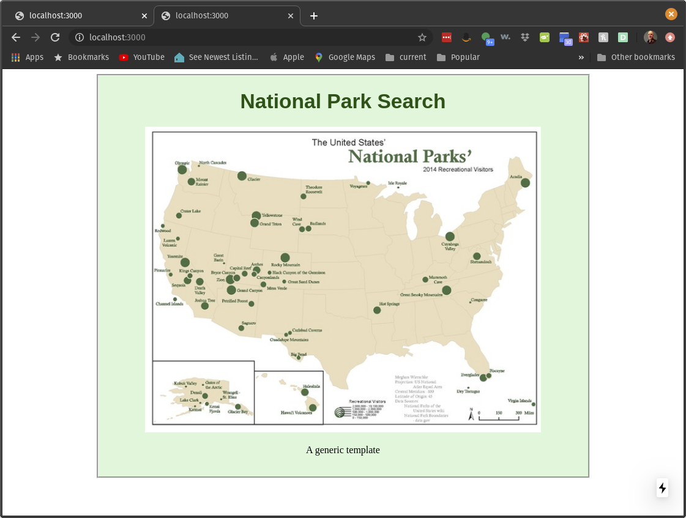
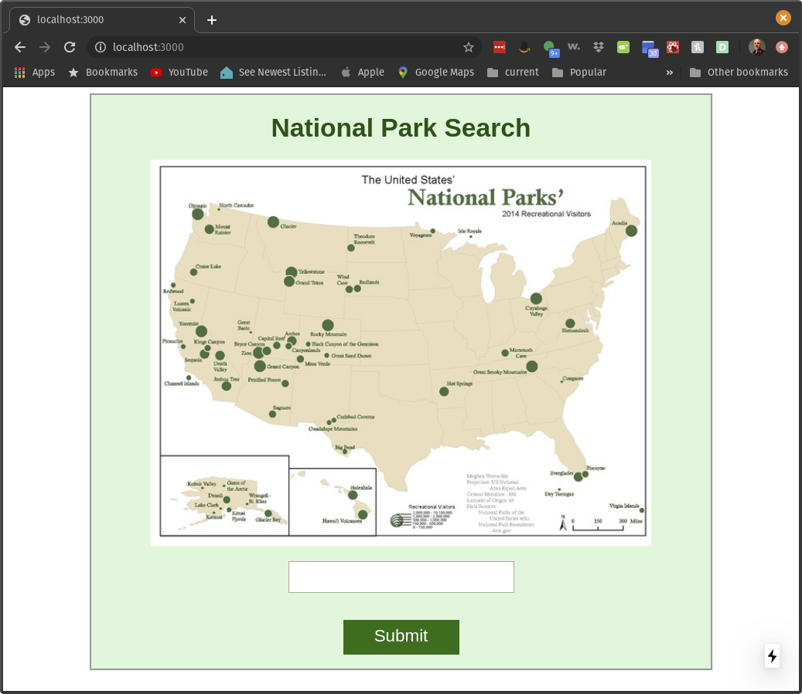
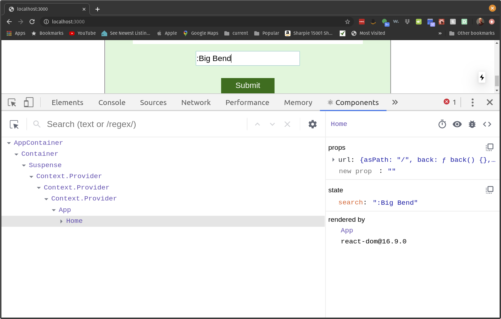
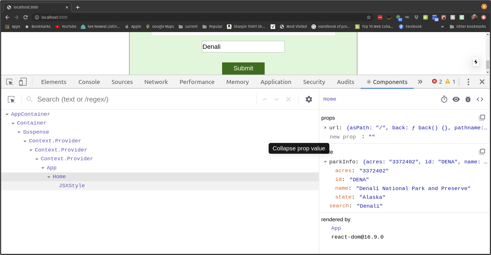
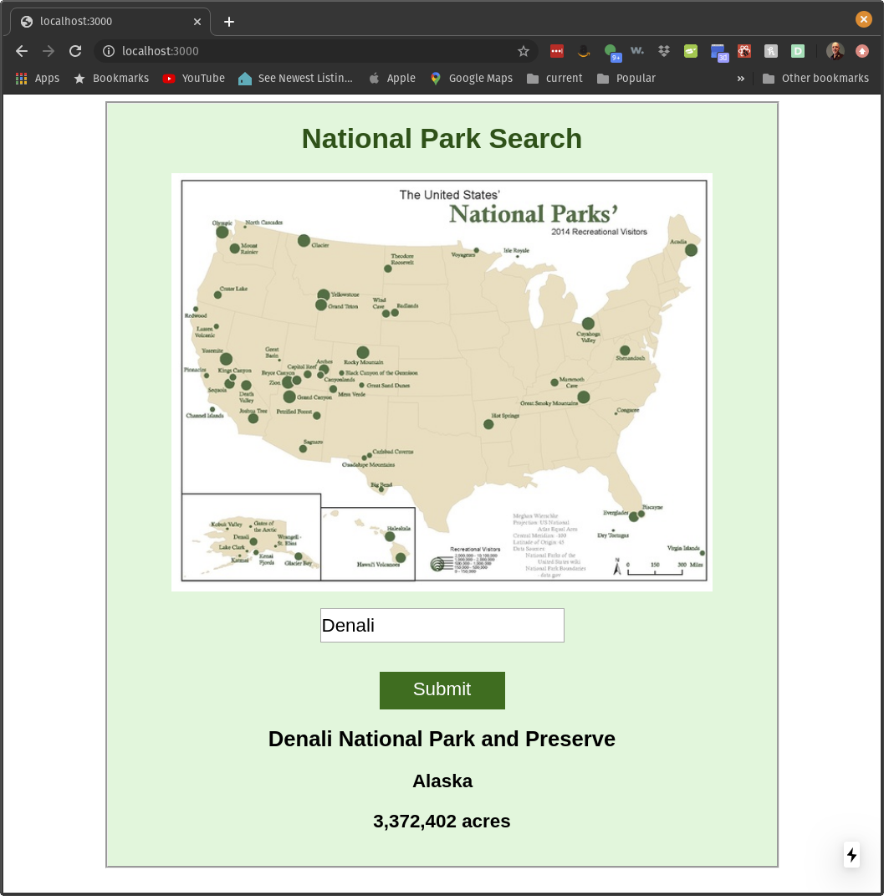

# Task 5. NextJS and National Parks


In the section you will learn how to connect a front end to an existing server.


## The steps

### Step 0 installation of software

In previous tasks you have installed

* nvm
* npm
* node


No additional software is needed for this step.

### Step 1 clone the code

The files we need are in the same folder as this readme file.  The easiest way to obtain the files is to clone the entire repository

`git clone https://github.com/zacharski/database-course.git`

For the gitlab lab we created our own git repository. We want to copy the task5 folder that was part of the repository we just cloned, to our db-class repository in the practice folder.  For example,

`cp -r tasks/task5 ~/db-class/practice`


### Step 2  run the NextJS server

Change directory into the task5 directory. First, we want to install the node modules specified in the `package.json` file:

```
{
  "name": "next-test-app",
  "version": "0.1.0",
  "private": true,
  "scripts": {
    "dev": "next dev",
    "build": "next build",
    "start": "next start"
  },
  "dependencies": {
    "bluebird": "^3.5.5",
    "isomorphic-fetch": "^2.2.1",
    "next": "9.0.4",
    "react": "16.9.0",
    "react-dom": "16.9.0"
  },
  "devDependencies": {
    "prettier": "^1.18.2"
  }
}
```

We do this by simply executing:


```
npm install
```


That will install those modules.


Next let's run the server by executing

```
npm run dev
```

You should see

```
> next dev

[ wait ]  starting the development server ...
[ info ]  waiting on http://localhost:3000 ...
...
[ wait ]  compiling ...
[ ready ] compiled successfully - ready on http://localhost:3000
```


In your browser go to `http://localhost:3000`. You should see


 

### Step 3 the backend


The backend is already provided for us. if we go to http://35.190.190.219/api/park?name=Denali  in your browser you should see the json:

```
{"id":"DENA","name":"Denali National Park and Preserve","state":"Alaska","acres":"3372402"}
```

We are going to modify the frontend template so it interfaces with this backend.

### Step 4 some look and feel components

Now we are going to modify the file `pages/index.js`. 


1. Let's change the title from *Template* to *National Park Search*
2. And let's change the image from `/static/logo.svg` to /static/nationalPark1.jpg

Now the page should look like



### Step 5 a text input field and a search button

Now we are going to add a text input field and a search button. Right below the `img` tag add

```

        <p>
          <input
            className="input-style"
            type="text"
            value={this.state.search}
          />
        </p>

        <div className="button-style">
          Submit
        </div>
```

And get rid of the *A generic template* text

In the constructor, after the `super(props)` line add

```
this.state = { search: "" };
```

Now our site should look like



### Step 6 the `handleUpdate` function

Now, when a user types something in the search box, we want to remember it by setting  `this.state.search` (recall that `search` was just a variable name we created, it is nothing special.)

The start of the function will be...

```
async handleUpdate(evt) {
```


Go ahead and finish that function using `setState`

Also we will need to add

```
onChange={this.handleUpdate.bind(this)}
```

to the input field.

Now, when we type something in the search box, we should see the state updated when we look at the components tab of the developer tools



See on the right column the state now has the search term updated to *Big Bend*


### Step 7 `utils.js` and `getParkInfo`

The file `lib/utils.js` is already provided to us. Notice that we have a function called `getParkInfo` that gets the information from the backend server it takes the name of the park as an argiument. We also have a module export `getInfo`.  We need to attach this code to our `index.js` file.


1. At the top of `index.js` import the module.
2. Add the following function stub and finish the code:


```javascript
async handleSearch(evt) {
    const parkInfo = "TODO"
    console.log(parkInfo);
    // add the information to the state
  }
```


3. To the `div` representing the submit button and an `onClick` event that calls `handleSearch`

Now when we search for a park, for example *Denali* we should see the state updated with the results of the search in the components tab of the developer tools:




### Step 8 display the results

We only want to execute this next part of the page if there are results. So, below the submit button we will add the conditional


```
this.state.parkInfo ? (
          <div>
            ...
          </div>
        ) : null}
```

So the contents of the `div` will only appear if there is `parkInfo`.  Within the `div`

1. display the name of the park using an `h2` tag
2. display the state the park is in using an `h3` tag
3. display the acres  using an `h3` tag so it looks like *3,123,123 acres*. The following hint will be helpful

If you look at the image above you will notices that the value of acres is a string, not an integer. We can convert that to a number using `parseInt`. So, for example

```
console.log(parseInt('123456') * 100)
```

will print out 12345600

Next we would like it to print nicely, with commas like 12,345,600. To do that we can use `toLocaleString()`

```
console.log((parseInt('123456') * 100).toLocaleString()) 
```

will print

```
12,345,600
```

With that complete, when we do a search for Denali we should see:



Nice!


### Step 9  push your code to your github repository. 

Again, make sure your `.gitignore` file includes `.env` and `node_modules` If you did everything correctly neither should be in your github folder.


### Step 10 notify the instructor 

