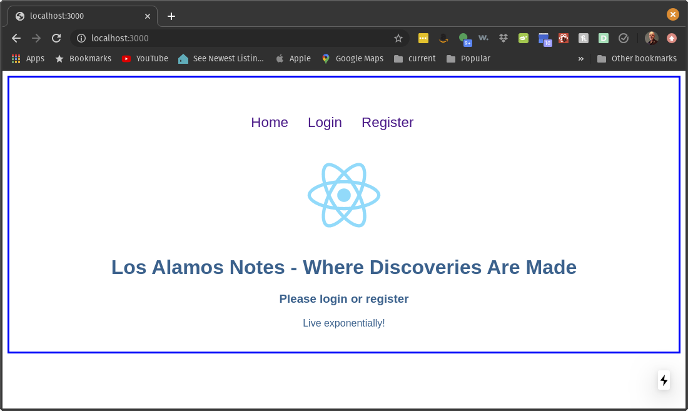
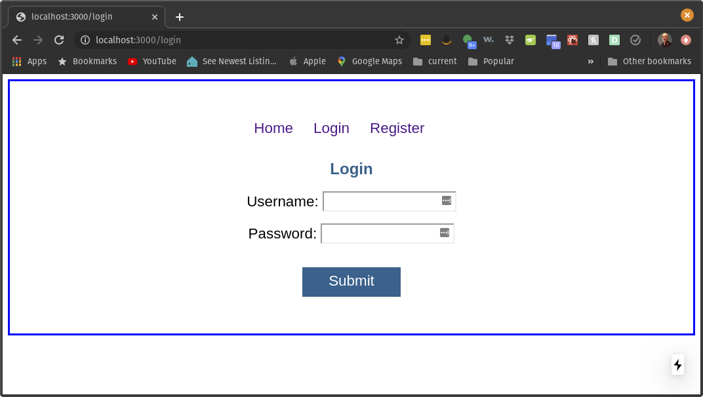
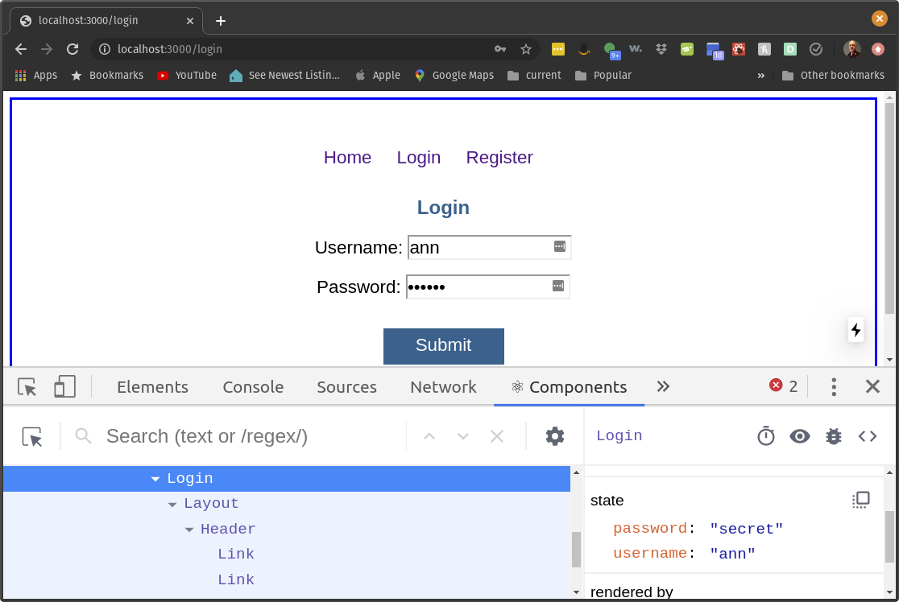
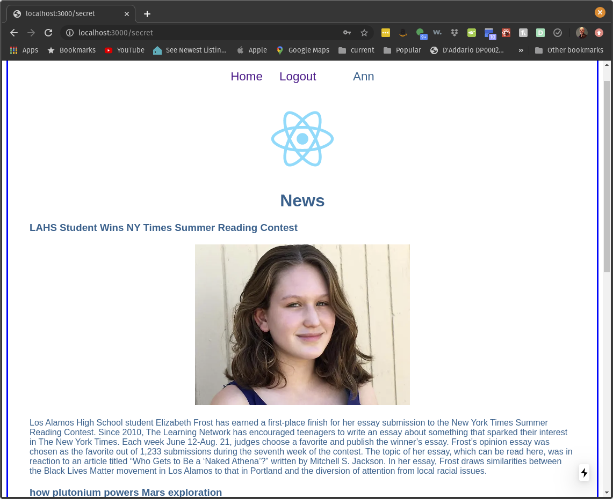

# Task 6. Persistence and Hashing


By now you have watched the videos on  

* hashing using Argon 2
* persistence using cookies


This task is designed to help you practice these skills. 

You can see a demo [here](https://youtu.be/j387JcxQJdY)

## The steps

### Step 0 installation of software

In previous tasks you have installed

* nvm
* npm
* node
* postgresql
* Postman


No additional software is needed for this step.

### Step 1 clone the code

The files we need are in the same folder as this readme file.  The easiest way to obtain the files is to clone the entire repository

`git clone https://github.com/zacharski/database-course.git`

For the gitlab lab we created our own git repository. We want to copy the task6 folder that was part of the repository we just cloned, to our db-class repository in the practice folder.  For example,

`cp -r tasks/task6 ~/db-class/practice`


### step 2 add a .env file with the following information

In the `task1` directory you need to add a file name `.env` with the contents:

```
DB_HOST=localhost
DB_USER=yourUser
DB_PASS=yourPassword

```

Replace the strings `yourUser` and  `yourPassword` with the database user and password that you are using for this task.. NOTE: It is an extremely bad idea to use the root account so create one unique to this task.. 

Make sure that .env is in your `.gitignore` file.  With the .env file we are making sure that passwords and other sensitive information in your code is not present in your github repository.


### Step 3 load the SQL file into the database

You are going to create an SQL file that creates the `logger` database and a table to store the user information. You should also grant permission to the user and password from the step above.

The table, named `users` should have fields named

name | comment
:---: | :---
username | The primary key of the table
password | The users hashed password
screenname | The user's name as it will appear on our website


Once you finished this file load it into PostgreSQL.

### Step 4 Install the libraries

In your terminal, if you haven't already, change into the task6 directory. Next execute:

`npm install`

This will install the necessary libraries. 

### Step 5 load the Postman file

load the supplied Postman collection file into Postman 

`passwordCheck.postman_collection.json`

### Step 6 the first execution

Finally we are going to run the code with 


`node server.js`


If you followed all the steps correctly you should see:

```
Find the server at http://localhost:8080
```

#### Verify that the server passes all the postman tests.


### Step 7 hashing passwords

We need to modify the `server.js` file to hash the passwords using argon2.

When you ran the postman tests, and look at the users table in postgres, it will look like


```
logger=# select * from users;
 username | password |  screenname  
----------+----------+--------------
 annm     | annm     | Ann
 marys    | marys    | Mary Spender
 sara     | sara     | Sara
(3 rows)

```

We don't want that. We want the passwords to be stored hashed:


```
username  |   password                       |  screenname  
----------+----------------------------------+--------------
 annm     | $argon2i$v=19$m=4096,t=3,p=1$etc | Ann
 marys    | $argon2i$v=19$m=4096,t=3,p=1$etc | Mary Spender
 sara     | $argon2i$v=19$m=4096,t=3,p=1$etc | Sara
(3 rows)

```

(I shortened the hashed password to make the writeup look better)

Go ahead and make that change to the server.js file and rerun the Postman tests to make sure everything works, and also make sure that the passwords are hashed by looking at the table in PostgreSQL.


#### this completes the backend work


### Step 8 the front end

Just to make working on this a bit easier we split the work into two servers. One that provides the backend support which we just finished. The other serves up the front end. 

Keep the backend running in one terminal (or make it a background process). 

In a separate terminal change to the `frontend` directory.

Do


```
npm install
npm run dev
```


if you point your browser to http://localhost:8080 you should see




Our task is to finish the login and register pages

### Step 9 login

The graphical interface for the login page is complete and looks like




(By 'complete' I mean it looks fine, we just need to add in the functionality)

When we ran the Postman file, we already inserted several users into the database:

username | password | screenname
:--- | :--- | :---
annm | annm | Ann
marys | marys |Mary Spender
sara | sara | Sara

We can use these users to test our login page before we create the register page.

To get the login page working we need to

1. add ` onChange=` handlers to each input field so the app saves the values in `this.state`
2. add code to `lib/utils.js` to call the backend server and get the results back. (Don't forget to import `getLogin` in your login.js file)
3. add an `onClick handler to the submit button div. A rough sketch of the handler might be ...


```

  async handleLogin(evt) {
    const loggedInUser = TODO;
    this.setState({ TODO });
    if (loggedInUser.status == "success") {
      // here we are setting a cookie 
      // TO DO
      
      // and now with a successful login, we redirect
      // to a different page.
      Router.replace("/secret");
    }
  }
```


Remember that as we do each step, we can check our results by using the `components` tab of the developer tools:




Once complete, you should be able to test it. Upon successful login the page will redirect to `secret` and the users name will be displayed in the top menu line.



### Step 10  registration

In a similar way, we need to complete the `register.js` page. When a user creates an account they should be automatically logged in and the page is redirected to `/secret`

Once this step is done the app is complete!

### Step 11  a reminder

Keep in mind that while we are learning good practices, this isn't the definitive way to do things. For example, we probably would want the user to confirm their password and have a check on the browser Javascript code that checks that they matched. Or have Javascript code that checks that the password meets certain criteria (a minimum length, must include numbers, etc.)


### Step 12 push your code to your github repository. 

Again, make sure your `.gitignore` file includes `.env` and `node_modules` If you did everything correctly neither should be in your github folder.


### Step 13 notify the instructor 

