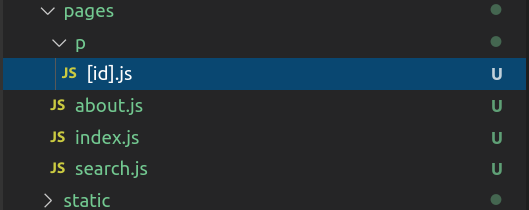

# Task 8. Getting started with Elasticsearch

## The submit process  

The submit process has an additional step:

1. commit your code to github 
2. **attach a video demo to a Slack dm to me.**
3. fill out the submit form

#### XP available

xp | criteria 
:---: | :---
40 | everything works and demo looks as good as mine
+20 | you can get betwen 0 and 20 additional points by having the app look better than mine or if you add additional features

The steps are outlined in the video.

#### 1. install Docker

Download and install [the Docker Desktop from here](https://www.docker.com/get-started)


#### 2. Install and Elasticsearch and Kibana Docker containers
Check out [installing the ELK stack](https://logz.io/blog/elk-stack-on-docker/)


#### 3. Write and test your first node application:
```
npm init -y
npm install @elastic/elasticsearch
```

The code

```
"use strict";

const { Client } = require("@elastic/elasticsearch");
const client = new Client({
  node: "http://localhost:9200",
  auth: { username: "elastic", password: "changeme" },
});

async function run() {
  // Let's start by indexing some data
  await client.index({
    index: "game-of-thrones",
    body: {
      character: "Ned Stark",
      quote: "Winter is coming.",
    },
  });

  await client.index({
    index: "game-of-thrones",
    body: {
      character: "Daenerys Targaryen",
      quote: "I am the blood of the dragon.",
    },
  });

  await client.index({
    index: "game-of-thrones",
    body: {
      character: "Tyrion Lannister",
      quote: "A mind needs books like a sword needs a whetstone.",
    },
  });

  // here we are forcing an index refresh, otherwise we will not
  // get any result in the consequent search
  await client.indices.refresh({ index: "game-of-thrones" });

  // Let's search!
  const { body } = await client.search({
    index: "game-of-thrones",
   body: {
      query: {
        match: { quote: "books" },
      },
    },
  });

  console.log(body.hits.hits);
}

run().catch(console.log);

```

Attribution: This code is from the [elastic documentation](https://www.elastic.co/guide/en/elasticsearch/client/javascript-api/current/search_examples.html)


#### 4. load data into Elasticsearch using Kibana
create a csv file of the campground info

```
id,name,image_url,closest_town,description,restrooms,image
1,Saddle,http://zacharski.org/files/campgrounds/saddleCampground.jpeg,"Cloudcroft, NM","Saddle Campground offers 16 single units for tents or RV's. Mixed conifer/aspen forest sites provide southern NM escape from summer heat on the desert floor Tables, fire rings, parking spurs, gray water sumps, toilets, showers, central garbage depository, plus interpretive trails. RVs are limited to a maximum of 30' in length.",Vault Toilet (2),
2,Apache,http://zacharski.org/files/campgrounds/saddleCampground.jpeg,"Cloudcroft, NM","Apache Campground offers 25 sites. Mixed conifer/aspen forest sites at 8,900' provide southern NM escape from summer heat on the desert floor. Tables, fire rings, parking spurs, gray water sumps, toilets, central garbage depository, plus interpretive trails. 24 family units spaced far apart. Tents are allowed and RVs limited to a maximum of 30' in length.",Vault Toilet (2),
3,Apache Creek,http://zacharski.org/files/campgrounds/saddleCampground.jpeg,"Reserve, NM",This is a nice quiet undeveloped campground amongst ponderosa pines and abundant wildlife. Apache Creek Campground is in the northwest region of the forest. There are plenty of trees to provide shade and this is a very clean campground.,Vault,
4,Three Rivers,http://zacharski.org/files/campgrounds/ThreeRivers_1000w-IMG_4666.jpg,"Ruidoso, NM",This rustic style campground has 12 sites set at the base of southern New Mexico's tallest mountain. A portion of the site is designed for Group Camping.  Three Rivers is a great place to go to get away from the crowds and is located at a much lower elevation than our other campgrounds (around 5000').  From here you can access the Three Rivers trailhead (T44) into the White Mountain Wilderness is located.  Access to the site and the roads throughout the site are all well maintained dirt roads.  Don't miss the Three Rivers Petroglyph Site on the way in or out.,Vault Toilet (3,
5,South Fork,http://zacharski.org/files/campgrounds/south-fork-campground.jpg,"Ruidoso, NM",One of the most popular camping sites on the Smokey Bear Ranger District. It has 60 Sites with a stay limit of 14 days. Fishing can be found nearby at Bonito Lake. Access to the White Mountain Wilderness Area can be found immediately at the south end of the Campground via the South Fork Trail (T19).  The early portion of this trail is moderately easy with the higher portions being difficult.,Vault Toilet (6),
6,Oak Grove,http://zacharski.org/files/campgrounds/south-fork-campground.jpg,"Ruidoso, NM","The campground has 30 campsites with vault toilets, a parking area, fireplaces, tables, and trash cans. Oak forest surroundings are close to mountain vistas of Sierra Blanca.",Vault Toilet (3),
7,Pueblo Park,http://zacharski.org/files/campgrounds/peublo-park.png,"Reserve, NM","Pueblo Park Campground is located in a large, cool stand of old growth ponderosa pines adjacent to the northern edge of the Blue Range Wilderness boundary with Dangerous Park Trail #515 on the northern end of the campground, and the WS Mountain Trail #43 immediately south of the campground entrance.",vault toilets,
8,Armijo Springs,http://zacharski.org/files/campgrounds/armijo_springs_2.jpg,"Quemado, NM","A real jewel of a secluded partially developed campground in ponderosa pine. Armijo Springs Campground is a secluded quiet campground off the beaten path, yet it is not too far from Quemado Lake. It is nestled among ponderosa pines and some oak trees which provide shade and make even the hottest summer day cool and bearable. There is a natural spring nearby.",Vault,
9,Wolf Hollow,http://zacharski.org/files/campgrounds/wolf-hollow.jpg,"Winston, NM","A remote campground on the northeast edge of the Gila Wilderness located south of New Mexico Hwy 59 (Beaverhead Road). High clearance vehicles are recommended. This campground is approximately 90 miles northeast of Truth or Consequences, NM",Yes,
10,Railroad Canyon,http://zacharski.org/files/campgrounds/canyon-campground.jpg,"Mimbres, NM","Railroad Canyon is the gateway to the Aldo Leopold Wilderness. Railroad Canyon Campground is a great place to spend the night before beginning your trip into the Aldo Leopold Wilderness. Situated in the Black Range Mountains, the campground is a popular portal for backcountry trips. Amenities are few and the camping is lean, however, nature seekers will appreciate the myriad of trails accessible from this campground.",1 Vault Toilet,
11,Piñon,http://zacharski.org/files/campgrounds/south-fork-campground.jpg,"Quemado, NM",The camp sites are nestled among mature piñon and juniper trees. It is tranquil and undiscovered with a few sites having a view of Quemado Lake. The campground is comprised of a family camping loop (east side) and a group camping loop (west side).,Vault,
12,James Canyon,http://zacharski.org/files/campgrounds/james_canyon.jpg,"Doña Ana, NM","James Canyon Campground offer 5 sites along US82 just west of Doña Ana, NM. The lower elevation of 6,800' means this small site is usable longer than most Sacramento Mountain area campgrounds when the snows begin. Picnic tables, grills, and one group ramada among scattered pine trees. 16' RV limit.",Vault Toilets (1),
13,Baca,http://zacharski.org/files/campgrounds/baca.jpeg,"Eagle's Point, NM","This camp was used as a CCC camp during the 1930's and has since been a popular place for hunters. It has spaces for camping, tents and small trailers and no as no water is usually available, there is no charge for the use of this site.  There is a nearby spring that may sometimes provide water, but please remember to bring your own source.",Vault Toilet (2),
14,Taylor's Railroad,http://zacharski.org/files/campgrounds/south-fork-campground.jpg,"Mimbres, NM","Railroad Canyon Campground is a great place to spend the night before beginning your trip into the Aldo Leopold Wilderness. Situated in the Black Range Mountains, the campground is a popular portal for backcountry trips. Amenities are few and the camping is lean, however, nature seekers will appreciate the myriad of trails accessible from this campground.",1 Vault Toilet,

```

And load it into kabana (http://localhost:5601) The machine learning/visualizing data pane


#### 5. write the backend code

You should be able to write the basic search request using both your previous work and the sample above as a guide. Retrieving a document by id looks like .

  

```
app.get("/retrieve", async (req, res) => {
  console.log("RETRIEVE ", req.query.id);
  const movie = await client.get({
    index: "movies",
    type: "_doc",
    id: req.query.id,
  });
  res.json(movie);
});
```


#### Step 6. Test your backend with Postman

Test your code by developing and using a few Postman tests


#### Step 7. Write the front end

You should be able to repurpose code you already have. A few things to note

My junky-looking result list was generated by


```
<ul>
              {this.state.emails.results.map((show) => (
                <li key={show.id}>
                  <Link href="/p/[id]" as={`/p/${show.id}`}>
                    <a>
                      {show.subject} {show.town} ({show.score})
                    </a>
                  </Link>
                </li>
              ))}
            </ul>
```

You can see that creates a url with `/p/idnumber`. My directory structure looks like this.



Notice that I have a directory p with a Javascript file name [id].js.

That `[id].js` file looks like


```
import Layout from "../../components/MyLayout";
import fetch from "isomorphic-unfetch";

const Post = (props) => (
  <Layout>
    <h1>{props.show.body._source.name}</h1>
    
    <h1>{props.show.body._source.closest_town}</h1>

    <p>{props.show.body._source.description}</p>

    <style jsx>{`
      h1,
      h2,
      h3,
      h4,
      a,
      p {
        font-family: "Arial";
        color: #34495e;
        font-size: 20px;
      }

      .text-style {
        margin: auto auto;
        width: 200px;
      }
    `}</style>
  </Layout>
);

Post.getInitialProps = async function (context) {
  const { id } = context.query;
  const res = await fetch(`http://192.168.1.122:8080/retrieve?id=${id}`);
  const show = await res.json();

  console.log(`Fetched show: ${show.name}`);
  console.log(show.body._source);
  return { show };
};

export default Post;

```


#### Step 8. Test, test, and test

Test your code to make sure everything is working.

#### Step 9. Make an awesome video 

If you made improvements that are difficult to appreciate from the video, be sure to include them in your commentary.

#### Step 10. push your code to github and fill out the submission sheet


1. 
